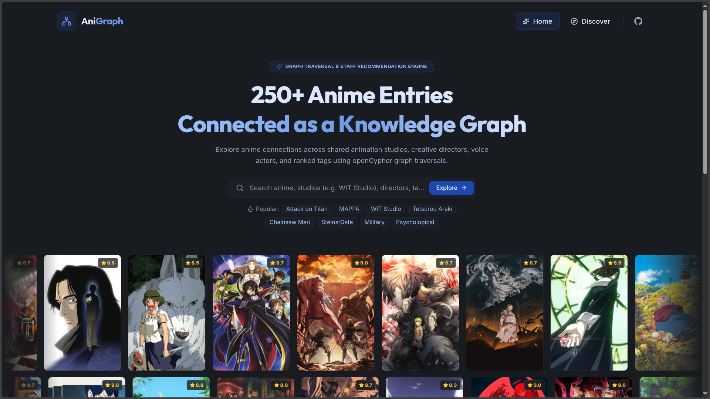
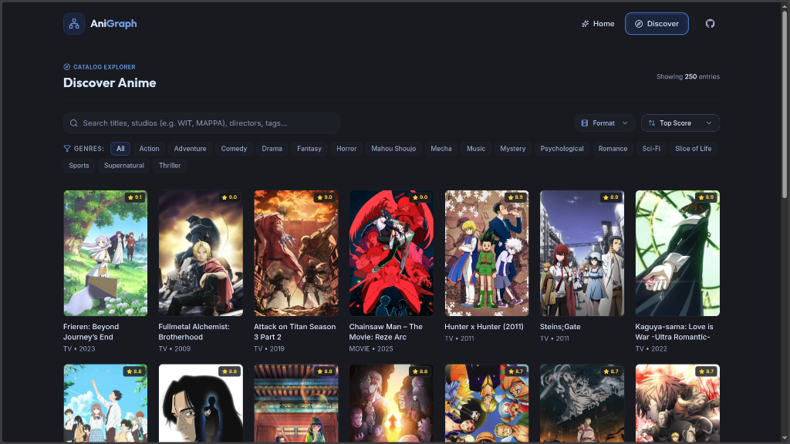
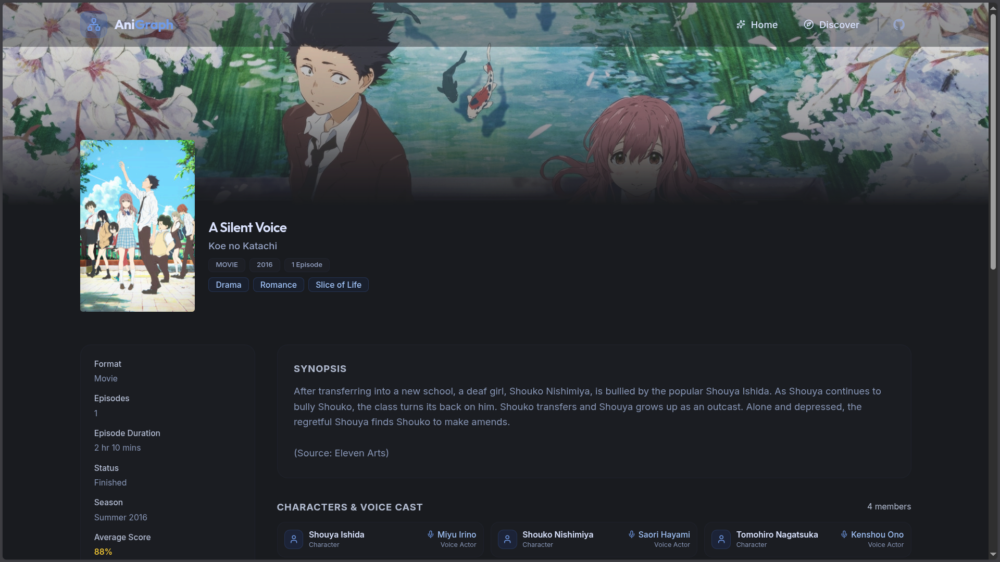
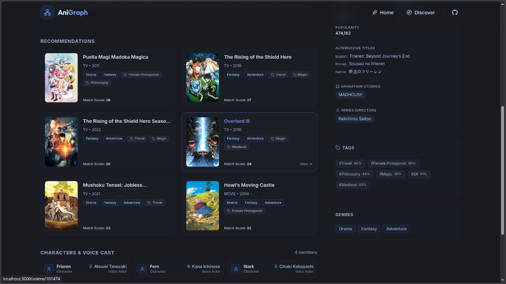
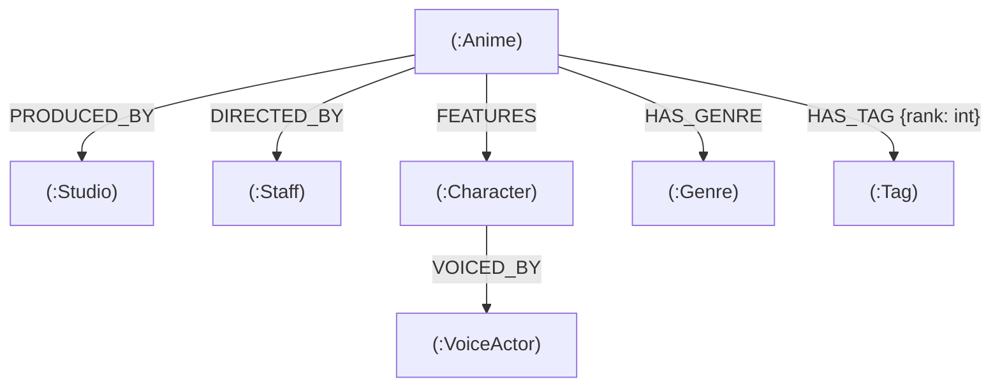

# AniGraph — Anime Knowledge Graph & Recommendation Engine

AniGraph is a full-stack anime discovery and recommendation web application powered by a graph database (**CognoDB Cloud / openCypher**) and real-world metadata ingested from the **AniList GraphQL API**.

Instead of basic keyword matching or flat genre filters, AniGraph models anime, animation studios, creative directors, voice actors, characters, genres, and thematic tags as a deeply connected knowledge graph. It traverses multi-hop graph relationships to generate context-aware recommendations and clearly explain _why_ each title was recommended.

---

## Visual Showcase

### 1. Home Page & Live Graph Explorer

Interactive hero showcase with real-time graph node metrics, quick search suggestions, and a smooth infinite marquee anime wall.



### 2. Catalog Explorer & Advanced Filtering

Instant search with multi-criteria filtering by format (TV, Movie, OVA), genres, animation studios, and real-time sorting.



### 3. Anime Details & Hero Artwork

Dynamic hero banner with backdrop artwork, responsive title hierarchy, expandable synopsis, and complete metadata sidebar.



### 4. Multi-Hop Graph Recommendations & Explainability

Graph recommendations ranked with tag-rank weighted match scores, structured reason badges (genres, tags, studio, director), and 2-hop character cast voice actors.



---

## Table of Contents

1. [Why a Graph Database?](#why-a-graph-database)
2. [Graph Data Model](#graph-data-model)
3. [Core Graph Queries Explained](#core-graph-queries-explained)
4. [Tech Stack](#tech-stack)
5. [Project Structure](#project-structure)
6. [Setup and Run Instructions](#setup-and-run-instructions)
7. [API Endpoints](#api-endpoints)
8. [Demo and Submission Links](#demo-and-submission-links)

---

## Why a Graph Database?

A relational (SQL) database works well for tabular data, but modeling and querying deep multi-dimensional connections between entities quickly becomes complex, slow, and expensive.

Here is what AniGraph achieves by leveraging a native Graph Database (**CognoDB / openCypher**) over SQL:

### 1. 2-Hop Multi-Hop Recommendations without Expensive Joins

In SQL, recommending anime through shared directors, studios, thematic tags, and genres requires:

- 4 separate junction tables (`anime_directors`, `anime_studios`, `anime_tags`, `anime_genres`)
- Multi-table `JOIN`s, subqueries, and `UNION` statements
- Heavy `GROUP BY` aggregations to score similarities

In openCypher, this multi-hop traversal is expressed naturally in a concise 2-hop pattern:

```cypher
MATCH (target:Anime {id: $id})-[r1]->(shared)<-[r2]-(rec:Anime)
WHERE rec.id <> target.id
```

### 2. Relationship-Level Properties

In AniList data, tags have community relevance ratings (e.g. _Time Travel: 95%_, _Kaiju: 93%_). In CognoDB, this `rank` is stored directly on the graph edge itself (`-[rt:HAS_TAG {rank: 93}]->`). In SQL, relationship properties demand separate columns in junction tables and extra join overhead.

### 3. Native Explainability

Because every relationship in the knowledge graph has an explicit edge label (`DIRECTED_BY`, `PRODUCED_BY`, `HAS_GENRE`, `HAS_TAG`), the database returns the exact traversal path in the same query:

- _"Same Director: Tetsurou Araki"_
- _"Same Animation Studio: WIT Studio"_
- _"Shared Tag: Survival (92%)"_

---

## Graph Data Model

### Knowledge Graph Architecture



### Nodes & Properties

- **`(:Anime)`**: `id` (AniList ID), `titleRomaji`, `titleEnglish`, `titleNative`, `description`, `format`, `status`, `episodes`, `duration`, `averageScore`, `popularity`, `season`, `seasonYear`, `coverImage`, `bannerImage`
- **`(:Studio)`**: `id`, `name` (Filtered to primary animation studios such as WIT Studio, MAPPA, Madhouse, Bones)
- **`(:Staff)`**: `id`, `name` (Series and Chief Directors)
- **`(:Character)`**: `id`, `name` (Main characters)
- **`(:VoiceActor)`**: `id`, `name` (Voice actors)
- **`(:Genre)`**: `name` (e.g. Action, Fantasy, Drama, Mystery, Sci-Fi)
- **`(:Tag)`**: `name` (e.g. Magic, Time Travel, Shounen, Female Protagonist)

### Relationships

- **`(:Anime)-[:PRODUCED_BY]->(:Studio)`**: Connects an anime to its animation studio.
- **`(:Anime)-[:DIRECTED_BY]->(:Staff)`**: Connects an anime to its series director.
- **`(:Anime)-[:HAS_GENRE]->(:Genre)`**: Connects an anime to its genres.
- **`(:Anime)-[:HAS_TAG {rank: int}]->(:Tag)`**: Connects an anime to thematic tags with rank relevance (0–100%).
- **`(:Anime)-[:FEATURES]->(:Character)`**: Connects an anime to its main characters.
- **`(:Character)-[:VOICED_BY]->(:VoiceActor)`**: Connects a character to their voice actor.

---

## Core Graph Queries Explained

All queries use parameterized openCypher via the official `neo4j-driver` connection pool.

### 1. Multi-Hop Recommendation Query with Weighted Scoring & Explainability

```cypher
MATCH (target:Anime {id: $id})
MATCH (target)-[r1]->(shared)<-[r2]-(rec:Anime)
WHERE rec.id <> target.id

WITH rec,
     collect(DISTINCT {
       type: type(r1),
       name: coalesce(shared.name, labels(shared)[0])
     }) AS reasons,
     round(sum(CASE type(r1)
       WHEN 'DIRECTED_BY' THEN 6.0
       WHEN 'PRODUCED_BY' THEN 4.0
       WHEN 'HAS_TAG'     THEN (coalesce(r1.rank, 60) * coalesce(r2.rank, 60)) / 1000.0
       WHEN 'HAS_GENRE'   THEN 2.0
       ELSE 1.0
     END)) AS matchScore

RETURN rec.id AS id,
       rec.titleRomaji AS titleRomaji,
       rec.titleEnglish AS titleEnglish,
       rec.coverImage AS coverImage,
       rec.averageScore AS averageScore,
       rec.format AS format,
       rec.seasonYear AS seasonYear,
       matchScore,
       reasons
ORDER BY matchScore DESC, rec.averageScore DESC
LIMIT $limit
```

**Scoring Weight Breakdown:**

- **Shared Creative Director**: `+6.0 points` (Directors shape tone, pacing, and visual storytelling).
- **Shared Animation Studio**: `+4.0 points` (Studios maintain signature visual fidelity and animation styles).
- **Shared Thematic Tag**: Scaled proportionally by multiplying both relevance ratings: `(r1.rank * r2.rank) / 1000.0` (A tag rated 90% in both adds `+8.1 points`).
- **Shared Genre**: `+2.0 points` (Broad baseline similarity).

---

### 2. Anime Details with 2-Hop Voice Cast Traversal

```cypher
MATCH (a:Anime {id: $id})
OPTIONAL MATCH (a)-[:HAS_GENRE]->(g:Genre)
OPTIONAL MATCH (a)-[rt:HAS_TAG]->(t:Tag)
OPTIONAL MATCH (a)-[:PRODUCED_BY]->(s:Studio)
OPTIONAL MATCH (a)-[:DIRECTED_BY]->(d:Staff)
OPTIONAL MATCH (a)-[:FEATURES]->(c:Character)
OPTIONAL MATCH (c)-[:VOICED_BY]->(va:VoiceActor)
RETURN a.id AS id,
       a.titleRomaji AS titleRomaji,
       a.titleEnglish AS titleEnglish,
       a.titleNative AS titleNative,
       a.description AS description,
       a.format AS format,
       a.status AS status,
       a.episodes AS episodes,
       a.duration AS duration,
       a.averageScore AS averageScore,
       a.popularity AS popularity,
       a.season AS season,
       a.seasonYear AS seasonYear,
       a.coverImage AS coverImage,
       a.bannerImage AS bannerImage,
       collect(DISTINCT g.name) AS genres,
       collect(DISTINCT { name: t.name, rank: coalesce(rt.rank, 60) }) AS tags,
       collect(DISTINCT s.name) AS studios,
       collect(DISTINCT d.name) AS directors,
       collect(DISTINCT {character: c.name, voiceActor: va.name}) AS cast
```

---

### 3. Summary Metrics & Knowledge Graph Counts

```cypher
MATCH (a:Anime)
WITH count(a) AS totalAnime
MATCH (s:Studio)
WITH totalAnime, count(s) AS totalStudios
MATCH (g:Genre)
WITH totalAnime, totalStudios, count(g) AS totalGenres
MATCH ()-[r]->()
RETURN totalAnime, totalStudios, totalGenres, count(r) AS totalRelationships
```

---

## Tech Stack

### Frontend (Client)

- **Framework**: React 19 + Vite
- **Routing**: React Router 7
- **Styling**: Tailwind CSS v4 + Curated Dark Palette
- **Animations & Micro-interactions**: Motion (`motion/react`)
- **Icons**: Lucide React
- **Code Quality**: ESLint 9 + Prettier

### Backend (Server)

- **Runtime**: Node.js (ES Modules)
- **Framework**: Express.js
- **Database Driver**: `neo4j-driver` (Bolt Protocol)
- **Database**: CognoDB Cloud / Memgraph (openCypher)
- **Data Pipeline**: AniList GraphQL API Fetcher with local fallback caching (`seed-cache.json`)

---

## Project Structure

```
AniGraph/
├── docs/
│   └── screenshots/              # README screenshots
│       ├── home.png
│       ├── discover.png
│       ├── details-hero.png
│       └── details-recommendations.png
├── client/                       # React frontend
│   ├── src/
│   │   ├── api/client.js         # API integration client
│   │   ├── components/
│   │   │   ├── common/           # AnimeCard, CustomDropdown, Pagination
│   │   │   ├── detail/           # DetailHeroBanner, DetailSynopsis, DetailMetadataSidebar, DetailCastList, DetailRecommendations, DetailSkeleton
│   │   │   ├── discover/         # DiscoverHeader, DiscoverFilters, DiscoverGrid, DiscoverEmptyState
│   │   │   ├── home/             # HeroSection, AnimeMarqueeWall, StatsShowcase, GraphFeatures
│   │   │   └── layout/           # Navbar, Footer, Layout
│   │   ├── pages/                # HomePage, DiscoverPage, AnimeDetailPage, NotFoundPage
│   │   ├── index.css             # Tailwind v4 theme & base typography
│   │   └── main.jsx              # React app entry point
│   ├── package.json
│   └── vite.config.js
└── server/                       # Express & CognoDB backend
    ├── scripts/
    │   ├── schema.cypher         # Constraint assertions & unique indexes
    │   ├── seed.js               # Batch graph ingestion script
    │   └── seed-cache.json       # Cached AniList dataset for instant seeding
    └── src/
        ├── config/               # Database pool & environment variables
        ├── controllers/          # Anime & stats route controllers
        ├── middlewares/          # Error handling middleware
        ├── queries/              # Parameterized openCypher queries
        ├── routes/               # Express REST API routes
        └── index.js              # Server entry point
```

---

## Setup and Run Instructions

### 1. Prerequisites

- **Node.js** (v18.0 or higher)
- **npm** (v9.0 or higher)
- A free account on **CognoDB Cloud** (https://console.cognodb.com)

---

### 2. Configure Backend Database & Environment

1. Sign up at [CognoDB Cloud](https://console.cognodb.com/signup) and create a free database instance.
2. Copy your connection URI (`bolt+s://<instance-id>.databases.cognodb.cloud`) and password.
3. In `server/`, create `.env` from `.env.example`:
   ```bash
   cd server
   cp .env.example .env
   ```
4. Update `server/.env` with your CognoDB credentials:
   ```env
   COGNODB_URI=bolt+s://<your-instance-id>.databases.cognodb.cloud
   COGNODB_USER=cognodb
   COGNODB_PASSWORD=your_password_here
   PORT=5000
   NODE_ENV=development
   ```

---

### 3. Install & Seed Database

```bash
# In server directory
cd server
npm install

# Seed graph database with 250 anime nodes & relationships
npm run seed
```

---

### 4. Start Backend Server

```bash
# In server directory
npm run dev
```

Backend will start on **`http://localhost:5000`**.

---

### 5. Start Frontend Client

In a new terminal:

```bash
cd client
npm install
npm run dev
```

Frontend application will launch at **`http://localhost:5173`**.

---

## API Endpoints

| Method | Endpoint                         | Query Parameters                | Description                                                             |
| :----- | :------------------------------- | :------------------------------ | :---------------------------------------------------------------------- |
| `GET`  | `/api/stats`                     | None                            | Returns total counts of anime, studios, genres, and graph relationships |
| `GET`  | `/api/anime`                     | `?search=titan&page=1&limit=20` | Paginated catalog search by title, studio, director, or tag             |
| `GET`  | `/api/anime/:id`                 | `id` (e.g. `16498`)             | Full anime details, formatted metadata, studios, directors, and cast    |
| `GET`  | `/api/anime/:id/recommendations` | `id`, `?limit=6`                | Multi-hop graph recommendations with match scores and explained reasons |

---

## Demo and Submission Links

- **Backend API Live Service**: https://anigraph-server.onrender.com
- **Frontend Live Demo**: https://anigraph-client.onrender.com
