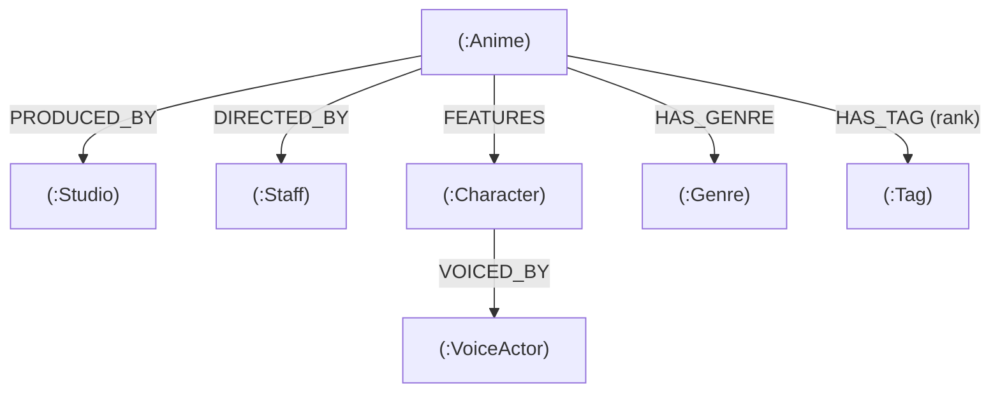

# AniGraph — Anime Knowledge Graph & Recommendation Engine

AniGraph is an anime recommendation web application built with a graph database (CognoDB Cloud / openCypher) using real data fetched from the AniList GraphQL API.

Instead of just filtering by a single genre or relying on basic tag matching, this project models anime, animation studios, directors, voice actors, characters, genres, and tags as an interconnected graph to find meaningful recommendations based on shared creative staff and themes.

---

## Table of Contents
1. [Project Overview](#project-overview)
2. [Why a Graph Database?](#why-a-graph-database)
3. [Graph Data Model](#graph-data-model)
4. [Main Graph Queries Explained](#main-graph-queries-explained)
5. [Project Structure](#project-structure)
6. [Setup and Run Instructions](#setup-and-run-instructions)
7. [API Endpoints](#api-endpoints)
8. [Demo and Submission Links](#demo-and-submission-links)

---

## Project Overview

When people look for anime recommendations, they usually care about things like:
- Was it made by the same director? (e.g. *Death Note* and *Attack on Titan* both directed by Tetsurou Araki)
- Was it animated by the same studio? (e.g. *Jujutsu Kaisen* and *Chainsaw Man* by MAPPA)
- Does it share specific themes? (e.g. *Magic*, *School*, *Romance* or *Time Travel*)

In a standard SQL database, connecting all these different entities requires many junction tables and heavy multi-table joins. By modeling this data as a graph, we can traverse across directors, studios, and tags in 2 or more hops to recommend anime and explain exactly why they were recommended.

---

## Why a Graph Database?

A relational database works well for flat tables, but exploring connections between different entities quickly becomes awkward and slow.

Here is what this project gains by using a graph database (CognoDB) over a relational database (SQL):

### 1. Multi-Hop Recommendations without Heavy Joins
In SQL, to find anime related to Anime A through shared directors, studios, tags, and genres, you would need:
- 4 separate junction tables (`anime_directors`, `anime_studios`, `anime_tags`, `anime_genres`)
- Multiple `INNER JOIN`s and `UNION` queries to combine the results
- Complex `GROUP BY` and `CASE` statements to calculate a match score

In openCypher, the exact same multi-hop search is written as a simple 2-hop pattern traversal:
```cypher
MATCH (target:Anime {id: $id})-[r1]->(shared)<-[r2]-(rec:Anime)
WHERE rec.id <> target.id
```

### 2. Relationship Properties
In AniList data, tags have a community relevance percentage (e.g. *Time Travel: 95%*). In a graph database, we store this `rank` property directly on the relationship itself (`-[rt:HAS_TAG {rank: 95}]->`). In SQL, relationship properties require an extra metadata column in a junction table and additional join logic.

### 3. Clear and Explainable Results
Because relationships have explicit types like `DIRECTED_BY`, `PRODUCED_BY`, and `HAS_TAG`, the database can return the exact list of reasons connecting two anime in one step:
- "Same Director: Tetsurou Araki"
- "Same Studio: WIT Studio"
- "Shared Tag: Military"

---

## Graph Data Model

### Diagram



### Nodes and Properties

- **`(:Anime)`**: `id` (AniList ID), `titleRomaji`, `titleEnglish`, `description`, `format`, `episodes`, `averageScore`, `seasonYear`, `coverImage`, `bannerImage`
- **`(:Studio)`**: `id`, `name` (Filtered to main animation studios like WIT Studio, MAPPA, Madhouse)
- **`(:Staff)`**: `id`, `name` (Series and Chief Directors)
- **`(:Character)`**: `id`, `name` (Main characters)
- **`(:VoiceActor)`**: `id`, `name` (Japanese voice actors)
- **`(:Genre)`**: `name` (e.g. Action, Fantasy, Drama, Mystery)
- **`(:Tag)`**: `name` (e.g. Magic, Time Travel, Shounen, School)

### Relationships

- **`(:Anime)-[:PRODUCED_BY]->(:Studio)`**: Connects an anime to its animation studio.
- **`(:Anime)-[:DIRECTED_BY]->(:Staff)`**: Connects an anime to its series director.
- **`(:Anime)-[:HAS_GENRE]->(:Genre)`**: Connects an anime to its genres.
- **`(:Anime)-[:HAS_TAG {rank: int}]->(:Tag)`**: Connects an anime to its tags with a relevance rating (0 to 100).
- **`(:Anime)-[:FEATURES]->(:Character)`**: Connects an anime to its main characters.
- **`(:Character)-[:VOICED_BY]->(:VoiceActor)`**: Connects a character to their voice actor.

---

## Main Graph Queries Explained

All queries use parameterized openCypher via the official `neo4j-driver` (no string concatenation).

### 1. Multi-Hop Recommendation Query with Weighted Scoring

This query finds anime that share connections with the target anime, computes a weighted score, and returns the list of reasons for the recommendation.

```cypher
MATCH (target:Anime {id: $id})
MATCH (target)-[r1]->(shared)<-[r2]-(rec:Anime)
WHERE rec.id <> target.id

WITH rec, 
     collect(DISTINCT {
       type: type(r1), 
       name: coalesce(shared.name, labels(shared)[0])
     }) AS reasons,
     round(sum(CASE type(r1)
       WHEN 'DIRECTED_BY' THEN 6.0
       WHEN 'PRODUCED_BY' THEN 4.0
       WHEN 'HAS_TAG'     THEN (coalesce(r1.rank, 60) * coalesce(r2.rank, 60)) / 1000.0
       WHEN 'HAS_GENRE'   THEN 2.0
       ELSE 1.0
     END)) AS matchScore

RETURN rec.id AS id,
       rec.titleRomaji AS titleRomaji,
       rec.titleEnglish AS titleEnglish,
       rec.coverImage AS coverImage,
       rec.averageScore AS averageScore,
       rec.format AS format,
       rec.seasonYear AS seasonYear,
       matchScore,
       reasons
ORDER BY matchScore DESC, rec.averageScore DESC
LIMIT $limit
```

**How the scoring works:**
- **Shared Director**: `+6.0 points` (Directors have a strong creative influence on pacing and style).
- **Shared Studio**: `+4.0 points` (Studios share visual and animation quality).
- **Shared Tag**: Scaled dynamically by multiplying both tag relevance ratings: `(r1.rank * r2.rank) / 1000.0`. If a tag is 90% relevant in both shows, it adds `+8.1 points`. If it is only 50% in both, it adds `+2.5 points`.
- **Shared Genre**: `+2.0 points` (Broad genre baseline).

---

### 2. Anime Details with 2-Hop Voice Cast Traversal

Fetches all details for an anime, including its genres, tags, studios, directors, and its main characters along with their voice actors in a single query:

```cypher
MATCH (a:Anime {id: $id})
OPTIONAL MATCH (a)-[:HAS_GENRE]->(g:Genre)
OPTIONAL MATCH (a)-[:HAS_TAG]->(t:Tag)
OPTIONAL MATCH (a)-[:PRODUCED_BY]->(s:Studio)
OPTIONAL MATCH (a)-[:DIRECTED_BY]->(d:Staff)
OPTIONAL MATCH (a)-[:FEATURES]->(c:Character)-[:VOICED_BY]->(va:VoiceActor)
RETURN a.id AS id,
       a.titleEnglish AS titleEnglish,
       a.description AS description,
       collect(DISTINCT g.name) AS genres,
       collect(DISTINCT t.name) AS tags,
       collect(DISTINCT s.name) AS studios,
       collect(DISTINCT d.name) AS directors,
       collect(DISTINCT {character: c.name, voiceActor: va.name}) AS cast
```

---

### 3. Graph Summary Counts

Counts the total number of nodes and relationships in the database:

```cypher
MATCH (a:Anime)
WITH count(a) AS totalAnime
MATCH (s:Studio)
WITH totalAnime, count(s) AS totalStudios
MATCH (g:Genre)
WITH totalAnime, totalStudios, count(g) AS totalGenres
MATCH ()-[r]->()
RETURN totalAnime, totalStudios, totalGenres, count(r) AS totalRelationships
```

---

## Project Structure

```
AniGraph/
├── .env.example
├── .gitignore
├── README.md
└── server/
    ├── package.json
    ├── scripts/
    │   ├── schema.cypher          # Constraints for unique IDs and indexes
    │   ├── seed.js                # Fetches AniList data and seeds CognoDB
    │   └── seed-cache.json        # Local cache for instant offline seeding
    └── src/
        ├── config/
        │   ├── database.js        # Driver connection pool & query runner
        │   └── env.js             # Environment variable loader
        ├── controllers/
        │   ├── anime.controller.js# /anime, /anime/:id, /anime/:id/recommendations
        │   └── stats.controller.js# /stats
        ├── middlewares/
        │   └── errorHandler.js    # Global error handling middleware
        ├── queries/
        │   ├── anime.queries.js   # Parameterized Cypher queries
        │   └── stats.queries.js   # Summary count query
        ├── routes/
        │   ├── anime.routes.js    # Anime router
        │   ├── stats.routes.js    # Stats router
        │   └── index.js           # Main router
        ├── utils/
        │   ├── anilist.js         # AniList GraphQL fetcher
        │   └── logger.js          # Timestamped console logger
        └── index.js               # Express server entry point
```

---

## Setup and Run Instructions

### 1. Prerequisites
- Node.js (v18 or higher)
- A free account on CognoDB Cloud (https://console.cognodb.com)

### 2. Create a Free CognoDB Instance
1. Sign up at https://console.cognodb.com/signup.
2. Create a free (c0) database instance.
3. Copy your Bolt URI (`bolt+s://<instance-id>.databases.cognodb.cloud`) and the generated password for user `cognodb`.

### 3. Set Up Environment Variables
Inside the `server/` folder, copy `.env.example` to `.env`:
```bash
cd server
cp .env.example .env
```

Add your CognoDB connection details in `server/.env`:
```env
COGNODB_URI=bolt+s://<your-instance-id>.databases.cognodb.cloud
COGNODB_USER=cognodb
COGNODB_PASSWORD=your_password_here
PORT=5000
NODE_ENV=development
```

### 4. Install Dependencies
```bash
cd server
npm install
```

### 5. Seed the Database
Run the seed script to fetch top anime from AniList and populate CognoDB:
```bash
npm run seed
```
*(This applies constraints from `schema.cypher` and batch-ingests the nodes and relationships in a few seconds).*

### 6. Start the Server
```bash
npm run dev
```
The server will start on `http://localhost:5000`.

---

## API Endpoints

| Method | Endpoint | Query Parameters | Description |
| :--- | :--- | :--- | :--- |
| `GET` | `/api/stats` | None | Returns total counts of anime, studios, genres, and relationships |
| `GET` | `/api/anime` | `?search=titan&page=1&limit=20` | Returns a paginated list of anime or searches by title |
| `GET` | `/api/anime/:id` | `id` (e.g. `16498`) | Returns anime details with studio, director, genres, and cast |
| `GET` | `/api/anime/:id/recommendations` | `id`, `?limit=6` | Returns graph-powered recommendations with scores and match reasons |

---

## Demo and Submission Links

- **Hosted Application Demo**: *(Link to be added upon frontend deployment)*
- **Screen Recording Video Walkthrough**: *(Link to be added upon recording)*
- **GitHub Repository**: https://github.com/Tiru0067/AniGraph
